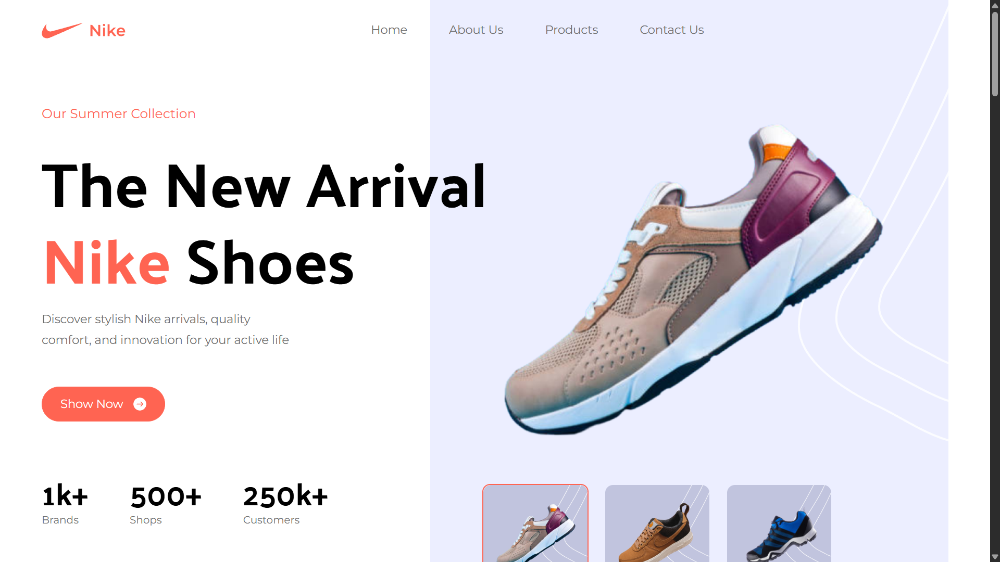

# Nike Landing Page

Welcome to the Nike Landing Page. This website is entirely frontend made to show the skills in designing and writing javascript efficient code 

## 📸 Screenshots



## 🚀 Installation

Follow these steps to set up and run the project on your local machine.

### 1. Clone the Repository

Clone the repository to your local machine using Git:

```bash
git clone https://github.com/NqabaXO/ACA.git
cd your-repository
```

### 2. Install Dependencies

Ensure you have [Node.js](https://nodejs.org/) installed. Then, install the project dependencies using:

```bash
npm install
```

or

```bash
yarn install
```


### 3. Run the Development Server

Start the development server using:

```bash
npm run dev
```

or

```bash
yarn dev
```

Your application will be available at `http://localhost:5173`.

## 📦 Usage

Navigate through the following sections of the website:

- **Home Page**: Features the design of the navigation bar, banner, footer as well as the different information.


## 📝 Acknowledgements

- **React**: A JavaScript library for building user interfaces.
- **Vite**: A fast build tool for modern web projects.
- **Tailwind CSS**: A utility-first CSS framework for designing beautiful interfaces.


This template provides a minimal setup to get React working in Vite with HMR and some ESLint rules.

Currently, two official plugins are available:

- [@vitejs/plugin-react](https://github.com/vitejs/vite-plugin-react/blob/main/packages/plugin-react/README.md) uses [Babel](https://babeljs.io/) for Fast Refresh
- [@vitejs/plugin-react-swc](https://github.com/vitejs/vite-plugin-react-swc) uses [SWC](https://swc.rs/) for Fast Refresh
